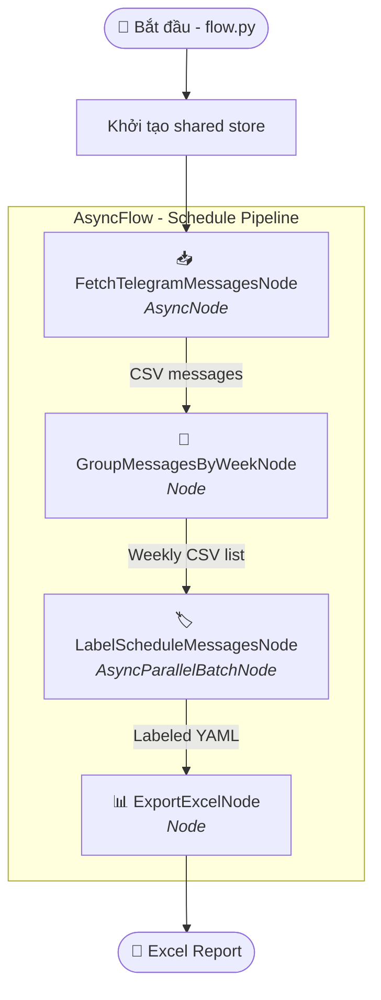
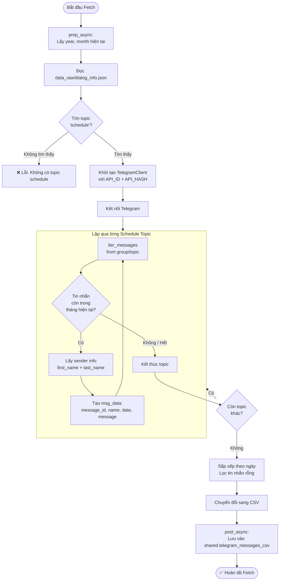
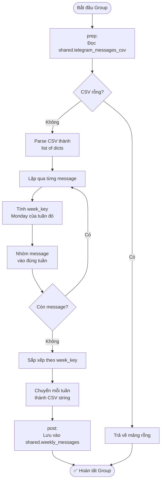
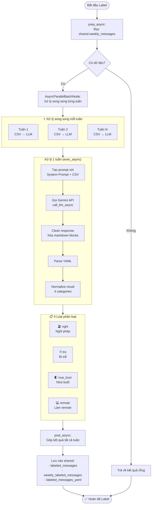
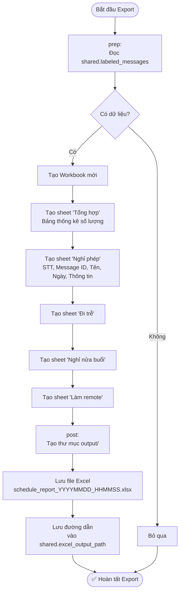
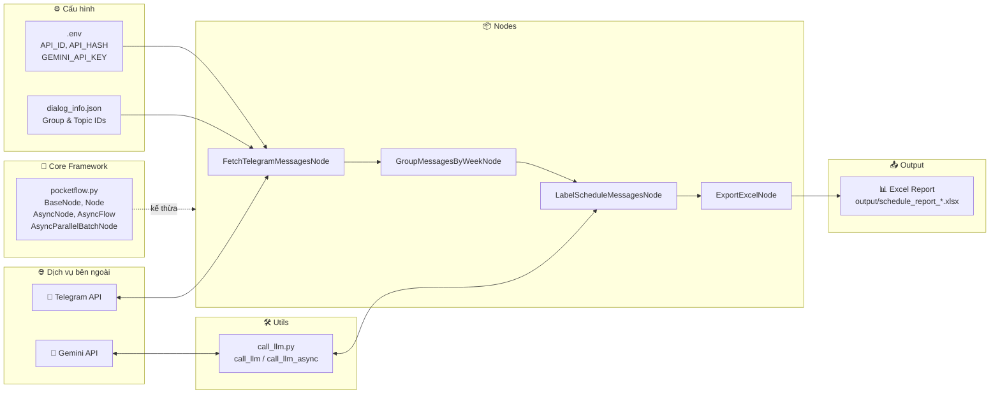
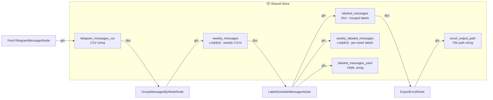

# Sơ đồ luồng hệ thống - AI Employee Schedule

## Tổng quan luồng chính (Main Flow)

## Chi tiết từng Node

### 1. FetchTelegramMessagesNode

### 2. GroupMessagesByWeekNode

### 3. LabelScheduleMessagesNode

### 4. ExportExcelNode

## Kiến trúc tổng thể

## Shared Store (Dữ liệu chia sẻ giữa các Node)

